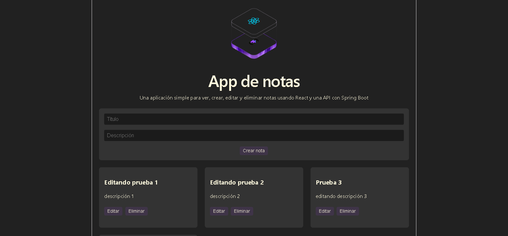
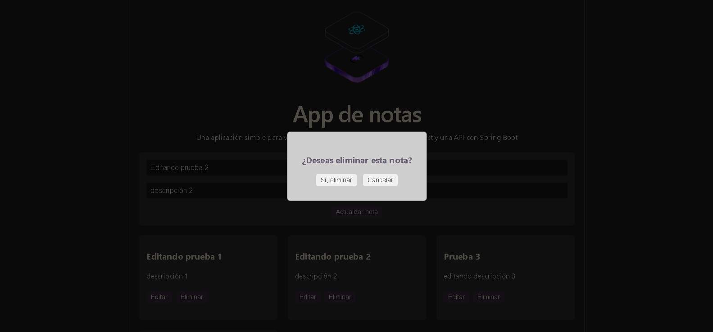

# App de Notas (Fullstack CRUD)

Una aplicación web completa (SPA) para la gestión de notas personales. Este proyecto fue desarrollado como una solución Fullstack, permitiendo realizar todas las operaciones CRUD (Crear, Leer, Actualizar y Eliminar) interactuando en tiempo real con una base de datos relacional.

---

## Tecnologías Utilizadas

### Frontend
* **React** 
* **Vite** 
* **CSS3** 

### Backend
* **Java** & **Spring Boot**
* **Spring Data JPA** & **Hibernate** 
* **MySQL** 

---

## Configuración e Instalación

1. Cloná este repositorio en tu máquina local.
2. Creá una base de datos en MySQL llamada `db_notas_fullstack`.
3. Configurá tu usuario y contraseña de MySQL en el archivo `src/main/resources/application.properties`.
4. Ejecutá la aplicación del backend desde tu IDE.
5. En otra terminal, ingresá a la carpeta `notasapp`, ejecutá `npm install` y luego `npm run dev` para levantar el frontend.

---

## Capturas de Pantalla

| Vista Principal | Modal de Confirmación |
| :---: | :---: |
|  |  |
